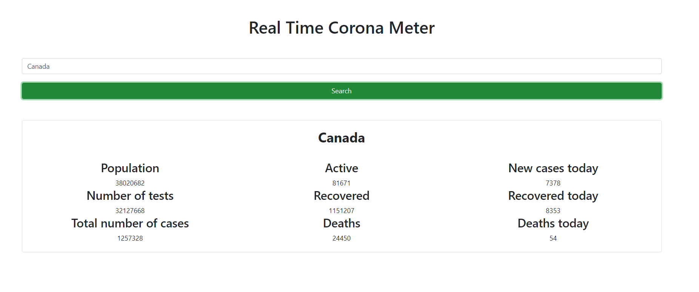

# Introduction
Real Time Covid Meter lets the user search for a particular country by name and in return getting the results such as number of active cases, total cases, deaths etc. in real-time.

# Setup the Project
1. Download the zip file-> extract all files-> open the folder in VS code
2. Now open termial in vs code (ctrl + `). 
3. Run the following command at folder level where package.JSON is there
  a. npm install
  b. npm run-script build
  c. npm run-script start (if this appears:"Would you like to run the app on another port instead? (Y/n):" type y).
4. The website opens.

  
